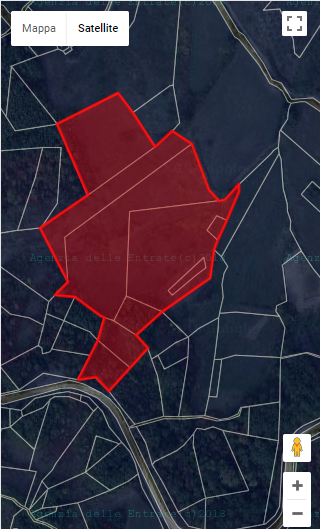

# machocavallo
Ionic app for GIS field monitoring using the <a target="_blank" href="http://www.agenziaentrate.gov.it/wps/content/nsilib/nsi/schede/fabbricatiterreni/consultazione+cartografia+catastale/servizio+consultazione+cartografia/indice+servizio+consultazione+cartografia">WMS service of Italian Agenzia delle Entrate</a> and <a target="_blank"  href="https://developers.google.com/maps/documentation/javascript/">Google Maps API</a>.

The app is used for:
- visualize the field perimeter
- track the GPS position (in field perimeter marking)
- add new fields

## The map

